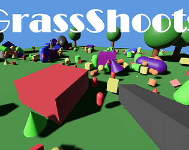

Fresh newbie using this game jam to learn Rust and Bevy.

Vibe coded using Antigravity Gemini 3 pro model.



---
# Asset used:
BGM: https://incompetech.com/music/royalty-free/music.html
SFX: https://www.kenney.nl

---
# Wasm build:

```bash
# 1. Build the project for WASM
cargo build --release --target wasm32-unknown-unknown

# 2. Generate the WASM glue code
wasm-bindgen --out-dir ./out --target web ./target/wasm32-unknown-unknown/release/grass_shoots.wasm

# 3. Optimize the WASM (Optional, requires wasm-opt)
wasm-opt -Oz -o out/grass_shoots_bg.wasm out/grass_shoots_bg.wasm

# Run a local server to test it
wasm-server-runner target/wasm32-unknown-unknown/release/grass_shoots.wasm
```

- Collect Files: Your ./out directory should now contain:
    - index.html
    - grass_shoots.js
    - grass_shoots_bg.wasm
    - The assets folder (containing your sounds and models).
- Go inside the out folder and zip everything.
- Upload:
    - Go to your itch.io project page.
    - Set Kind of project to HTML.
    - Upload the ZIP.
    - Check the box "This file will be played in the browser".
